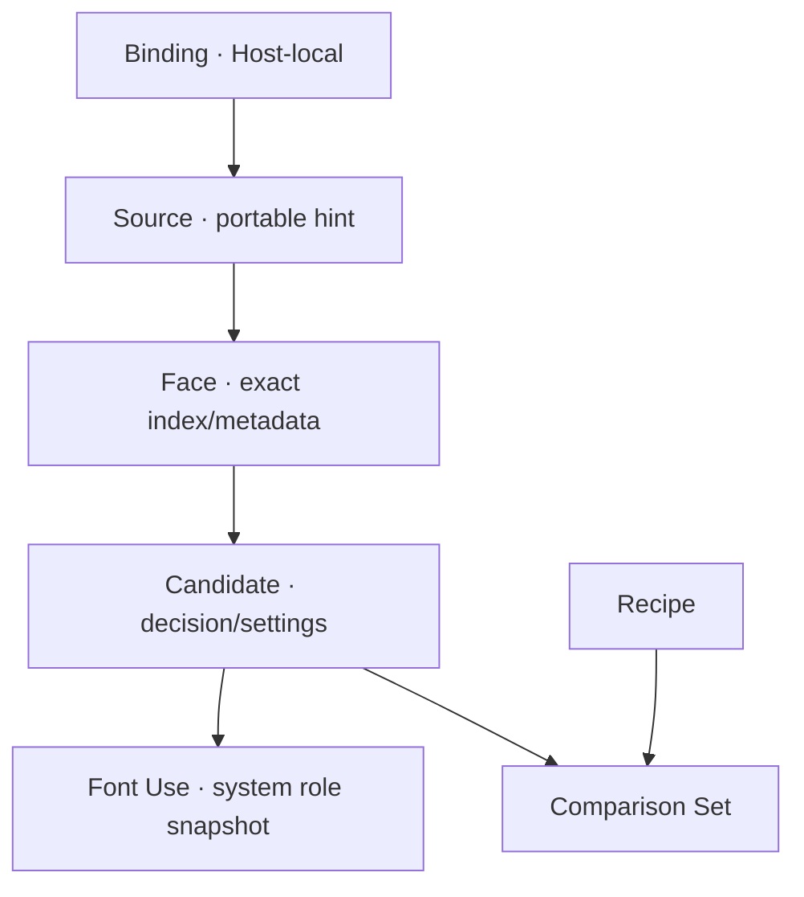

# Font Previewer architecture

## Product boundary

Font Previewer is one local product delivered by two desktop Hosts:

- macOS: AppKit window, native menus/panels, CoreText discovery, and a shared Studio inside WKWebView;
- Linux: Electron main process, native menus/dialogs, Fontconfig discovery, and the same sandboxed Studio;
- browser: a development fallback with reduced capabilities.

No Host installs fonts, exposes arbitrary filesystem access to the Studio, or requires an account/network service.

## Two views, one session

Simple and Studio render the same `StudySession`; they are not separate document formats or synchronized copies.

- Adding local or installed Sources in either view runs the same bounded `ingest-sources` command and creates the same Faces and Candidates.
- Copy, casing, variable axes, Candidate order, review/include decisions, tray membership, Comparison Sets, and Typography Systems remain shared semantic state.
- The active Same size / Fit each / Lock line breaks choice is controlled once at the application boundary and passed into both Simple boards and Studio Compare. Saving a Comparison Set records that policy in the portable Study.
- Interface mode, 80–140% UI scale, temporary stress visibility, index-page inclusion, and an unsaved Source-copy checkbox are presentation/export preferences, not a second Study authority.

Simple is the low-friction front door. Studio remains the deeper Review → Compare → System → Handoff workspace.

## Authority

The Studio owns one mutable `StudySession`: portable document, workspace state, revision, acknowledged recovery revision, and intentionally saved revision. Semantic commands pass through one reducer and one bounded history.

The Host owns privileged and platform-local state only:

- Source ID → canonical local binding;
- opaque preview-token → local file;
- native document destination and recents;
- recovery file;
- installed Catalog index/cache;
- file watchers, panels, menus, packaging, and Handoff destination.

The Host does not mirror selected Candidate, active stage, review state, Recipe, Comparison Set, or Typography System as a second mutable UI authority.

## Domain model

Family is grouping evidence, not identity. Durable IDs are not derived from paths, names, PostScript names, or digests. A portable Study contains no local path, preview URL, bookmark, or Binding.

## HostBridge protocol v2

Requests and responses use a closed discriminated vocabulary with exact-key runtime validation. Privileged requests include launch state, import, paginated Catalog search, mirror, Save, Handoff, relink/reveal, native undo, reload, and bounded probe.

Important bounds:

- Study JSON: 8 MB;
- one Source: 512 MB;
- direct import: 2,048 files, 2 GB total, depth 12, 15 seconds;
- installed Catalog index: 10,000 entries;
- Catalog response: 200 entries maximum; UI asks for 80;
- Catalog metadata cache: 400 entries;
- Compare tray: four Candidates.

The Studio receives display metadata and `pitch-font://asset/<opaque-token>` capabilities, never a filesystem path.

## Catalog versus Study

CoreText or Fontconfig builds a Host-local searchable index. A Catalog query returns only one bounded page of inspected metadata. Browsing or rebuilding the Catalog is workspace activity and cannot change the Study.

An explicit Add action sends selected `ImportedSource` records through the semantic `ingest-sources` command. The next recovery mirror promotes those temporary Catalog bindings into durable Host-local bindings. Study capacity is checked before mutation; excess Sources are refused without corrupting the document.

## Font rendering

Both current Hosts use the Studio’s CSS/`FontFace` interactive path with opaque Host-served font URLs. macOS uses CoreText for installed-font discovery and metadata; Linux uses Fontconfig plus bounded local inspection. The renderer declares its Host profile.

The product claims semantic parity, not raster parity. WebKit/CoreText and Chromium may shape or rasterize differently. Complex-script coverage metadata is evidence, not a promise of typographic correctness. V1 gives full preview support to OTF/TTF/WOFF/WOFF2 and metadata-only support to TTC/OTC/DFONT.

## Recovery and intentional Save

After a semantic revision or workspace-only change, the Studio mirrors the validated document/workspace to the Host. Workspace checkpoints use the current semantic revision without pretending navigation changed the portable document. The renderer drops obsolete delayed checkpoints; the Electron Host serializes accepted writes; and the Host atomically commits recovery before acknowledging it. Lower semantic revisions are rejected.

Save and Handoff first require the exact current revision to be mirrored. Intentional Save writes `.pitchfontstudy`; recovery remains a separate Host-owned file and never silently becomes the user’s saved document.

## Handoff transaction

The Host:

1. validates revision, outputs, the visible internal Source-copy policy, and destination;
2. creates a hidden staging directory inside the destination;
3. writes selected screenshots/PDF/summary/JSON/CSV;
4. optionally copies unique Sources only after explicit redistribution acknowledgement;
5. hashes outputs and writes manifest/checksums;
6. atomically moves staging to a collision-safe final directory;
7. removes staging on failure.

When Simple is visible, the Studio exposes a bounded in-memory board-rendering capability to its Host. The Host validates the manifest against the mirrored Study, requests each 5,152 × 2,160 PNG, checks PNG structure and decoded dimensions, then includes `Boards/` and optional `Index/` files in the same transaction. The capability is absent outside Simple mode.

## Host security

Electron uses Chromium sandboxing, context isolation, no Node integration, a bundled local page, denied external navigation/windows/permissions, trusted-sender checks, and a bundled CommonJS preload exposing only `HostPort`.

WKWebView uses a nonpersistent website-data store, separate bounded read-only schemes for Studio assets and font tokens, a named content world, main-frame request checks, exact request parsing, denied external navigation/popups, and a web-content termination reload handler.

Font files, Studies, Catalog output, bridge messages, recovery files, and export destinations are untrusted. File traversal canonicalizes paths, rejects symlinks in imports, bounds work, and never logs or serializes client paths into portable artifacts.

## Packaging

Linux packages the exact Electron runtime as a portable archive and root-owned `.deb`; the Chromium sandbox helper must be root/root mode 4755. macOS compiles the Host against the current SDK, embeds the production Studio, signs ad hoc, verifies strictly, and creates a ZIP/checksum.

Both carry the repository licence and third-party notices. The v0.1 Mac ZIP enables hardened runtime and uses only an ad-hoc identity; Developer ID signing/notarization are deliberately absent and never claimed.

## Preserved reference

The root `macos/` SwiftUI/CoreText app is retained as an output oracle and engine seed. It is not linked into `app/`, does not define the release-candidate Study contract, and must not be confused with the active AppKit/WKWebView Host.
