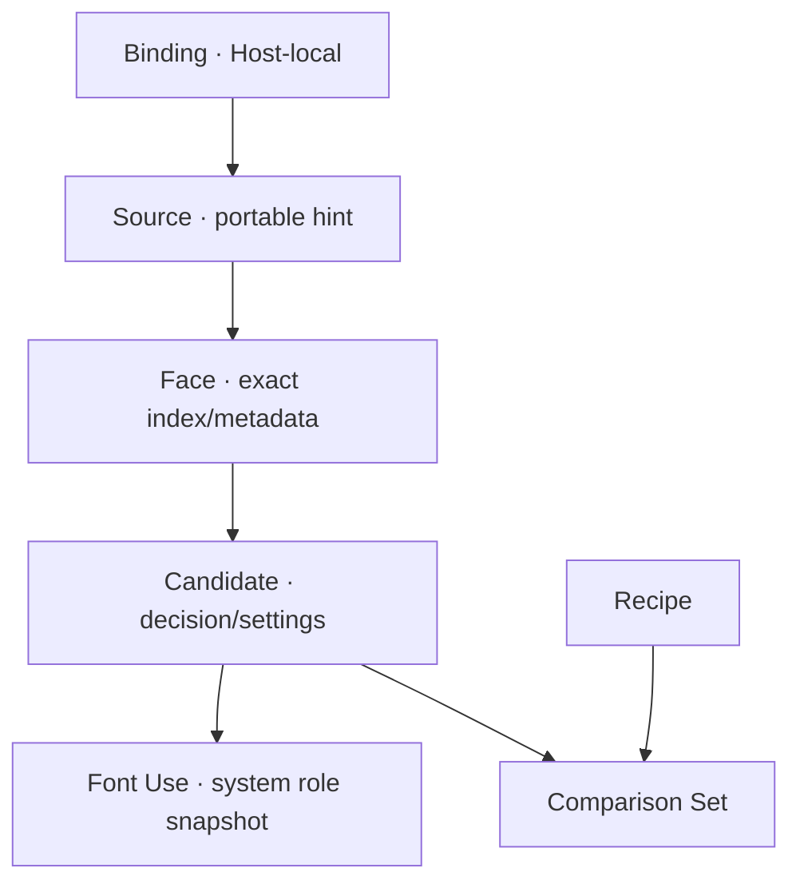

# Font Previewer architecture

## Product boundary

Font Previewer is one local product delivered by two desktop Hosts:

- macOS: AppKit window, native menus/panels, CoreText discovery, and a shared Studio inside WKWebView;
- Linux: Electron main process, native menus/dialogs, Fontconfig discovery, and the same sandboxed Studio;
- browser: a development fallback with reduced capabilities.

No Host installs fonts, exposes arbitrary filesystem access to the Studio, or requires an account/network service.

## Two views, one session

Simple and Studio render the same `StudySession`; they are not separate document formats or synchronized copies.

- Adding local or installed Sources in either view runs the same bounded `ingest-sources` command. Simple assigns new Candidates to the active Headlines or Body Copy set; Sources and Faces are not duplicated merely because they are used in both sets.
- Candidate set membership, casing, variable axes, order, review/include decisions, tray membership, Comparison Sets, and Typography Systems remain shared semantic state. Each Simple set stores its own copy and fit policy in the portable Study.
- Duplicating a font or copying it into the other set deliberately creates a new Unreviewed Candidate with independent settings. Both Candidates retain a reference to the same Face; this is not background synchronization between views.
- The active Same size / Fit each / Lock line breaks choice is passed into Simple pages and Studio Compare. A Simple set retains its own choice; Body Copy additionally derives one shared fitted reading size for every included page. Saving a Comparison Set records the comparison policy in the portable Study.
- Interface mode, 80–140% UI scale, temporary stress visibility, index-page inclusion, and an unsaved Source-copy checkbox are presentation/export preferences, not a second Study authority.

Simple is the low-friction front door. **Headlines + subheadlines** produces four-up Boards and optional index pages; **Body Copy** produces one-font reading pages from its independent Candidate set. Studio remains the deeper Review → Compare → System → Handoff workspace over all Candidates.

Study v5 adds the two Simple set configurations and Candidate membership. A v4 migration preserves IDs, settings, and decisions, treats existing Candidates as Headlines, and leaves Body Copy empty. The new schema is retained on Save; older applications must reject it rather than silently dropping set data.

## Authority

The Studio owns one mutable `StudySession`: portable document, workspace state, revision, acknowledged recovery revision, and intentionally saved revision. Semantic commands pass through one reducer and one bounded history.

The Host owns privileged and platform-local state only:

- Source ID → canonical local binding;
- opaque preview-token → local file;
- native document destination and recents;
- recovery file;
- installed Catalog index/cache;
- file watchers, panels, menus, packaging, and Handoff destination.

The Host does not mirror selected Candidate, active stage, review state, Recipe, Comparison Set, or Typography System as a second mutable UI authority.

## Domain model

```mermaid
flowchart TD
  S["Source · portable hint"] --> F["Face · exact index/metadata"]
  B["Binding · Host-local"] --> S
  F --> C["Candidate · decision/settings"]
  C --> U["Font Use · system role snapshot"]
  R["Recipe"] --> X["Comparison Set"]
  C --> X
```

Family is grouping evidence, not identity. Durable IDs are not derived from paths, names, PostScript names, or digests. A portable Study contains no local path, preview URL, bookmark, or Binding.

## HostBridge protocol v2

Requests and responses use a closed discriminated vocabulary with exact-key runtime validation. Privileged requests include launch state, import, paginated Catalog search, mirror, Save, Handoff, relink/reveal, native undo, reload, and bounded probe.

Important bounds:

- Study JSON: 8 MB;
- one Source: 512 MB;
- direct import: 2,048 files, 2 GB total, depth 12, 15 seconds;
- installed Catalog index: 10,000 entries;
- Catalog response: 200 entries maximum; UI asks for 80;
- Catalog metadata cache: 400 entries;
- Compare tray: four Candidates.

The Studio receives display metadata and `pitch-font://asset/<opaque-token>` capabilities, never a filesystem path.

## Catalog versus Study

CoreText or Fontconfig builds a Host-local searchable index. A Catalog query returns only one bounded page of inspected metadata. Browsing or rebuilding the Catalog is workspace activity and cannot change the Study.

An explicit Add action sends selected `ImportedSource` records through the semantic `ingest-sources` command. The next recovery mirror promotes those temporary Catalog bindings into durable Host-local bindings. Study capacity is checked before mutation; excess Sources are refused without corrupting the document.

## Font rendering

Both current Hosts use the Studio’s CSS/`FontFace` interactive path with opaque Host-served font URLs. macOS uses CoreText for installed-font discovery and metadata; Linux uses Fontconfig plus bounded local inspection. The renderer declares its Host profile.

Named styles are coordinates of one physical variable Face, not additional collection Faces. macOS collapses named descriptors for supported single-face formats and reads default axis values; Linux separates Fontconfig's encoded named-instance index from the physical face index. Named style selection applies the complete coordinate set in one semantic command. Historical nonzero Face indices may still preview only when the Source is a supported single-face variable format with a full-preview Binding; genuine collections do not gain a rendering fallback.

The interactive registry keys resources by Source and Binding identity, so ordinary copy, casing, and axis edits do not reload font files. Simple Preview and Tune each expose 12 Candidates per batch. Their combined visible Faces need at most 24 Source resources, shared where Candidates use the same Source, with at most four concurrent loads. Leaving a batch releases resources no longer required. This bound applies to Simple's interactive registry, not to Studio or temporary export resources.

The product claims semantic parity, not raster parity. WebKit/CoreText and Chromium may shape or rasterize differently. Complex-script coverage metadata is evidence, not a promise of typographic correctness. V1 gives full preview support to OTF/TTF/WOFF/WOFF2 and metadata-only support to TTC/OTC/DFONT.

## Recovery and intentional Save

After a semantic revision or workspace-only change, the Studio mirrors the validated document/workspace to the Host. Workspace checkpoints use the current semantic revision without pretending navigation changed the portable document. The renderer drops obsolete delayed checkpoints; the Electron Host serializes accepted writes; and the Host atomically commits recovery before acknowledging it. Lower semantic revisions are rejected.

Save and Handoff first require the exact current revision to be mirrored. Intentional Save writes `.pitchfontstudy`; recovery remains a separate Host-owned file and never silently becomes the user’s saved document.

## Handoff transaction

The Host:

1. validates revision, outputs, the visible internal Source-copy policy, and destination;
2. creates a hidden staging directory inside the destination;
3. writes selected screenshots/PDF/summary/JSON/CSV;
4. optionally copies unique Sources only after explicit redistribution acknowledgement;
5. hashes outputs and writes manifest/checksums;
6. atomically moves staging to a collision-safe final directory;
7. removes staging on failure.

When Simple is visible, the Studio exposes a bounded in-memory page-rendering capability to its Host. Export scope selects Headlines, Body Copy, or both. Headlines produces four-up `Boards/` with optional `Index/`; Body Copy produces one page per included Body Candidate in `Body Copy/`. A combined manifest counts both sets without conflating their copy, fit policies, or Candidate membership. Rejected Candidates are excluded; preview pagination does not limit export.

The Host validates scope and exact Candidate/page counts against the mirrored Study, requests each 5,152 × 2,160 PNG sequentially, checks PNG structure and decoded dimensions, and includes the files in the same transaction. The renderer preserves each Candidate's variation and feature settings, releases temporary export fonts and canvases, and computes the shared Body Copy size once for the immutable export runtime. Impossible, inconsistent, or out-of-scope manifests fail before commit. The capability is absent outside Simple mode.

## Host security

Electron uses Chromium sandboxing, context isolation, no Node integration, a bundled local page, denied external navigation/windows/permissions, trusted-sender checks, and a bundled CommonJS preload exposing only `HostPort`.

WKWebView uses a nonpersistent website-data store, separate bounded read-only schemes for Studio assets and font tokens, a named content world, main-frame request checks, exact request parsing, denied external navigation/popups, and a web-content termination reload handler.

Font files, Studies, Catalog output, bridge messages, recovery files, and export destinations are untrusted. File traversal canonicalizes paths, rejects symlinks in imports, bounds work, and never logs or serializes client paths into portable artifacts.

## Packaging

Linux packages the exact Electron runtime as a portable archive and root-owned `.deb`; the Chromium sandbox helper must be root/root mode 4755. macOS compiles the Host against the current SDK, embeds the production Studio, signs ad hoc, verifies strictly, and creates a ZIP/checksum.

Both carry the repository licence and third-party notices. The v0.1 Mac ZIP enables hardened runtime and uses only an ad-hoc identity; Developer ID signing/notarization are deliberately absent and never claimed.

## Preserved reference

The root `macos/` SwiftUI/CoreText app is retained as an output oracle and engine seed. It is not linked into `app/`, does not define the release-candidate Study contract, and must not be confused with the active AppKit/WKWebView Host.
