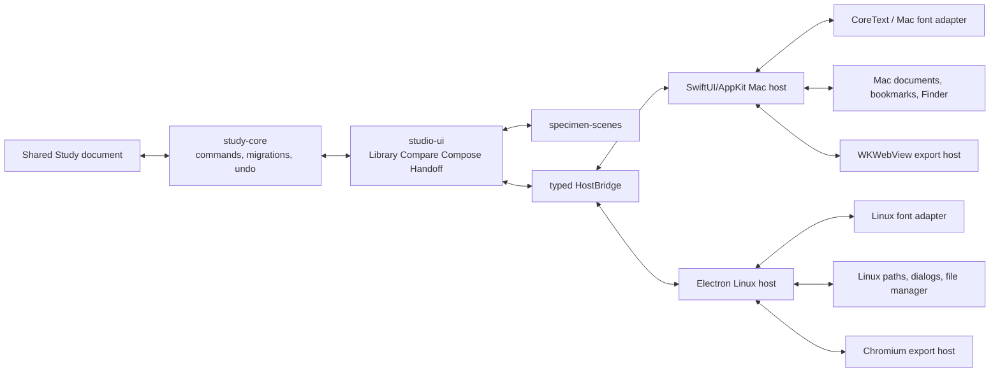
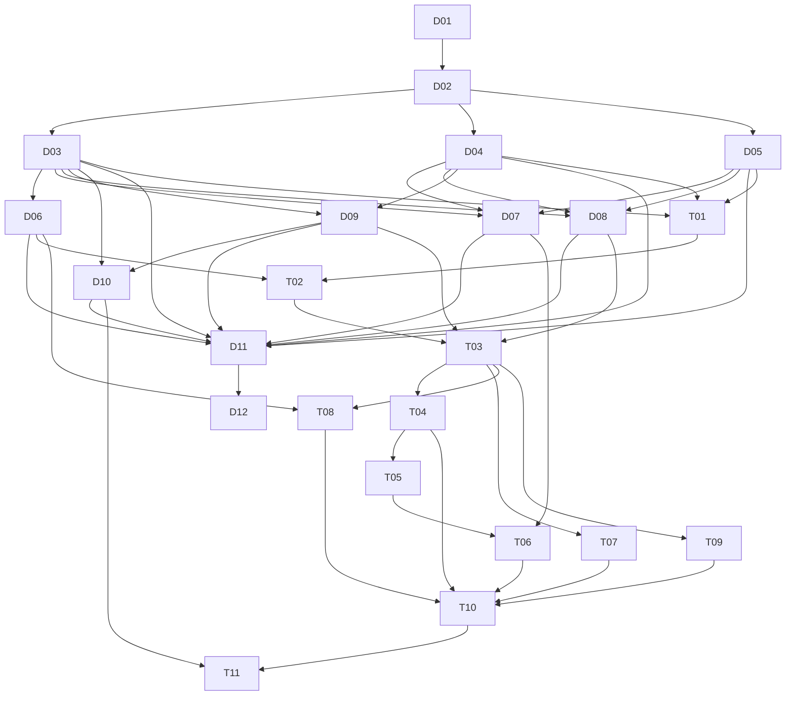

# Font Previewer
## Two-App Product, Architecture, and Delivery Wayfinder

**Planning date:** 26 August 2026  
**Status:** Deep planning draft. No implementation authorized by this document.  
**Target products:**  
1. **Font Previewer for Mac** — the reference product; Apple-Silicon-only; SwiftUI/AppKit host with a bundled WebKit studio.  
2. **Font Previewer for Linux** — a first-class Linux companion; Electron host using the same bundled studio and product contract.

---

## 0. Executive verdict

The right answer is **not** “build a Mac app, then copy it into Electron.”

The right answer is:

> **One local typography-decision product, one portable study format, one shared studio, one shared interaction and export contract, and two platform hosts.**

The two applications should share:

- domain language;
- study-document semantics;
- review decisions;
- specimen recipes;
- comparison and pairing behavior;
- scene geometry;
- design tokens;
- keyboard grammar;
- handoff structure;
- bridge protocol;
- migration rules;
- error vocabulary;
- product copy where platform conventions do not require divergence.

They should **not** share by force:

- window chrome;
- file dialogs;
- menus;
- shortcuts where platform conventions differ;
- installed-font discovery;
- filesystem permissions;
- source watching;
- text-rasterization output;
- packaging;
- OS integration;
- accessibility implementation details;
- crash-recovery storage;
- renderer process architecture.

The Mac app is the reference product. The Linux app is not a disposable port. It gets the same product model and central studio, with a Linux-native host contract and honest renderer differences.

The current native SwiftUI/CoreText branch remains valuable. It becomes:

1. a **validated native reference spike**;
2. a source of proven document, import, export, and CoreText behavior;
3. the basis of the Mac host’s font-intelligence adapter;
4. a visual and performance oracle during migration.

It should not dictate the final UI architecture.

---

# Part I — Destination

## 1. Wayfinder destination

### Destination statement

Create a decision-complete product and architecture for a local-only font auditioning system delivered as:

- an arm64 macOS reference app using SwiftUI/AppKit and WKWebView;
- a Linux Electron companion using the same web studio;
- a shared `.pitchfontstudy` document contract;
- a shared specimen and handoff model;
- platform-specific font, filesystem, and packaging adapters;
- no cloud dependency, account, telemetry, or font upload.

### Success condition

A deck designer can:

1. open a folder, a set of font files, or installed fonts;
2. see useful pitch-deck specimens quickly;
3. reduce a large candidate set without losing context;
4. compare shortlisted faces fairly;
5. inspect variations, features, glyph support, and practical metadata when needed;
6. assign selected faces to deck roles;
7. save the study;
8. reopen it on Mac or Linux;
9. relink missing sources without rebuilding decisions;
10. export a clear, client- or team-readable handoff.

### The ten-star product test

The ten-star version is not the app with the most font tables.

It is the app where:

- the first useful comparison appears before the user starts thinking about the tool;
- a folder with a messy family produces a coherent family/face view;
- Keep / Maybe / Reject decisions feel almost physical;
- “same point size” and “fit to frame” are both available, because they answer different questions;
- the app remembers *why* a face survived;
- role assignment immediately becomes a believable deck specimen;
- complex font controls stay out of the way until they matter;
- missing files do not destroy the study;
- handoff output is more useful than a screenshot folder;
- the Mac and Linux apps open the same study without pretending their rasterizers are identical.

---

## 2. Product constitution

These are not features. They are constraints against product drift.

### 2.1 The product is a decision instrument

Font Previewer helps a person audition, compare, decide, compose, and hand off typography for pitch decks.

It is not a general font manager.

### 2.2 Local means local

- No font upload.
- No account.
- No cloud processing.
- No analytics SDK.
- No remote code.
- No hidden licence scan service.
- No external network request required for core use.
- Update checking, if ever added, is separately consented and visibly optional.

### 2.3 Reversible before clever

- Import never installs.
- Remove-from-study never deletes a font.
- Relink never discards notes or decisions.
- Export stages before committing.
- Every long-running job can be cancelled.
- Undo and redo operate on meaningful domain commands.

### 2.4 Typography is the content

The interface must not compete with the fonts.

- restrained chrome;
- stable geometry;
- one functional accent;
- no card-on-card sludge;
- no decorative glass layer over the specimen;
- no movement without navigational or causal value;
- no permanent metadata wall.

### 2.5 Progressive disclosure

The default journey is:

> import → review → compare → compose → handoff

Axes, OpenType features, coverage, glyphs, metrics, file metadata, embedding metadata, and fallback diagnostics appear in contextual inspection—not in the first screen.

### 2.6 No fake objectivity

The app may expose evidence:

- fitted size;
- x-height and metrics;
- missing characters;
- fallback use;
- axis coordinates;
- OpenType settings;
- source availability;
- embedding metadata.

It must not invent:

- “best font” scores;
- emotional truth scores;
- luxury/playfulness percentages;
- automatic pairings presented as fact;
- accessibility certification from a scalar-coverage check.

### 2.7 Semantic parity, not pixel theatre

The same study, command, role, recipe, decision, and scene must mean the same thing on both platforms.

Glyph rasterization can differ because WebKit/CoreText and Chromium/HarfBuzz/FreeType are different engines.

Cross-platform pixel equality is not a product requirement.

### 2.8 Evidence, not ceremony

A gate exists only when it catches a material regression, resolves a risky uncertainty, or protects user work.

No test exists because “a serious project should have more tests.”

---

## 3. Product boundary

### In scope

- importing font files and folders;
- scanning installed fonts;
- family and face organization;
- static and variable faces;
- review states;
- notes, tags, rationale;
- reusable pitch-deck specimen recipes;
- fair comparison modes;
- role assignment;
- character and script evidence;
- OpenType feature inspection;
- variable-axis inspection;
- hot reload;
- missing-source relinking;
- portable study documents;
- PNG/PDF and structured handoff;
- privacy-safe Figma reference data;
- local export bundles;
- keyboard-first use;
- Mac and Linux parity at the semantic layer.

### Explicitly out of scope for the first stable product

- font installation;
- font activation/deactivation;
- font deletion;
- outline editing;
- kerning editing;
- hinting;
- font generation;
- synthetic italic or weight generation;
- licence interpretation;
- paid-font redistribution;
- Windows;
- mobile;
- cloud sync;
- collaboration;
- accounts;
- web service;
- Figma API or Figma plugin;
- automatic font purchasing;
- automatic AI pair selection;
- UFO, Designspace, Glyphs, VFB, or TTX editing;
- browser extensions;
- general-purpose font QA dashboards;
- arbitrary scripting inside the app.

### Why font management stays out

Installation and activation look adjacent but change the product materially:

- they mutate the operating system;
- they create privilege and permissions problems;
- they add rollback and trash semantics;
- they make Linux desktop differences central;
- they increase support burden;
- they distract from the deck decision journey.

Borrow the browsing and organization lessons from font managers. Do not become one.

---

# Part II — Product language

## 4. Canonical glossary

The project should create `docs/CONTEXT.md` and use these terms consistently.

### Source

A font-containing file or logical provider known to a host.

Examples:

- `Family-Regular.otf`;
- `Family.ttc`;
- a font found through installed-font discovery.

A Source is not a Face.

### Source binding

Host-local information that tells one installation where a Source lives.

Examples:

- an absolute Linux path;
- a macOS security-scoped bookmark;
- a last-known modification signature.

Bindings do not belong in the portable study document.

### Face

One selectable typographic face inside a Source.

A collection Source may contain many Faces.

### Family

A user-facing grouping of related Faces.

Family is grouping, not identity.

### Instance

A named or custom location in a variable Face’s design space.

### Recipe

A reusable specimen definition.

A Recipe includes:

- text;
- scene;
- size policy;
- alignment;
- line-height;
- tracking;
- casing;
- background;
- feature settings;
- axis settings or axis policy;
- metadata visibility.

### Scene

The visual context in which typography is judged.

Core scenes:

- Review;
- Focus;
- Compare;
- Waterfall;
- Deck;
- Glyphs;
- Metrics.

### Review decision

One of:

- Keep;
- Maybe;
- Reject.

A decision is not a tag.

### Role

A functional deck assignment.

Recommended initial roles:

- Display;
- Body;
- Data;
- Caption;
- Legal;
- Utility.

### Shortlist

A deliberate set of Faces under active comparison.

### Comparison set

An ordered, saved group of Faces and optionally locked Recipes.

### Study

The portable user document containing decisions, recipes, roles, comparison sets, and portable Source references.

### Catalog

A host-local index of discoverable Sources and Faces.

The Catalog is not the Study.

### Handoff

The exported evidence and settings required for another person or tool to understand and reproduce the decision.

### Capability

A privileged operation exposed by the host to the studio.

Examples:

- choose sources;
- reveal in file manager;
- read a specific approved Source;
- save a Study;
- run an export.

### Host

The platform-specific application layer.

Hosts:

- Mac host;
- Linux host.

### Studio

The shared TypeScript/React web application loaded inside WKWebView or Electron.

### Renderer

The browser engine that visually lays out specimens.

- WebKit on Mac;
- Chromium on Linux.

### Font-intelligence adapter

A host service that extracts normalized metadata and diagnostic evidence from font files.

---

## 5. Identity model

The current path-plus-face-index identity is useful for deduplication on one machine, but it is not a durable cross-platform identity.

Recommended model:

```text
SourceID = random durable identifier created when a source enters a Study
FaceID   = SourceID + faceIndex
```

### Portable Source reference

```ts
type PortableSourceRef = {
  id: SourceID
  displayName: string
  fileName: string
  relativePath?: string
  byteLength?: number
  modifiedAtHint?: string
  digestHint?: string
  formatHint?: string
}
```

### Portable Face reference

```ts
type PortableFaceRef = {
  id: FaceID
  sourceID: SourceID
  faceIndex: number
  familyName: string
  styleName: string
  postScriptName?: string
  metadataSnapshot: FaceMetadataSnapshot
}
```

### Host-local binding

```ts
type HostSourceBinding = {
  studyID: StudyID
  sourceID: SourceID
  absoluteLocator: OpaqueHostLocator
  lastSeenSignature?: SourceSignature
  lastResolvedAt?: string
}
```

### Dedupe key

Within one host:

```text
canonical resolved path + collection face index
```

The dedupe key must not replace the durable FaceID.

### Digest policy

A digest is optional.

Use it only when it materially improves relinking or change detection.

Rules:

- computed locally;
- never used as public identity;
- never shown by default;
- absent from handoff unless explicitly useful;
- never presented as a fingerprint that proves licence or authorship.

---

# Part III — Users and journeys

## 6. Primary users

### 6.1 Deck designer

Needs to move through many possible fonts quickly without installing them or losing project context.

### 6.2 Creative director

Needs to compare a small shortlist, understand rationale, and approve or reject.

### 6.3 Writer-designer

Needs to test real copy, not alphabet soup, across title, paragraph, data, caption, and legal use.

### 6.4 Small creative team

Needs a portable decision record that survives moving between machines and operating systems.

### Secondary users

- type-conscious founders;
- filmmakers making their own pitch material;
- students;
- independent designers;
- type designers checking deck-context behavior.

The secondary users must not pull the product into font editing or general QA.

---

## 7. Core jobs to be done

1. **When I have too many candidate fonts, help me reduce them without losing why I liked or rejected them.**
2. **When two fonts both look good, let me compare them under fair and intentionally different conditions.**
3. **When a font is variable, let me inspect the authored space without turning the app into an aircraft cockpit.**
4. **When a font works as a title but fails as body copy, let me express that as a role decision rather than a binary favorite.**
5. **When I hand work to another designer, give them the settings, evidence, and source references—not merely screenshots.**
6. **When a source moves or changes, preserve my work and help me reconnect it.**
7. **When I move a study between Mac and Linux, preserve meaning even if the text engines rasterize differently.**

---

## 8. Journey A — First launch

### Screen

A quiet welcome view with:

- **New Study**
- **Open Study**
- **Add Fonts or Folder**
- **Scan Installed Fonts**
- recent studies, if any;
- one sentence: “Your fonts stay on this computer.”

### No first-launch tour carousel

Tours delay the first useful result and are forgotten.

Use:

- excellent empty states;
- one contextual tip at a time;
- a replayable “Getting started” sample study;
- command discoverability in menus and tooltips.

### First useful action

Dropping font files anywhere should:

1. visually accept the drop;
2. show candidate discovery;
3. group faces coherently;
4. open the Review scene;
5. focus the specimen text;
6. preserve the import report in a dismissible task panel.

### Success target to validate

A user with a 20–50 face folder reaches a meaningful comparison in under one minute without documentation.

---

## 9. Journey B — Import

### Entry paths

- drag files;
- drag folders;
- native picker;
- installed-font scan;
- reopen a Study and resolve bindings.

### Import preflight

For small imports, no blocking preflight screen.

For unusually large or risky imports, show:

- files discovered;
- faces discovered;
- collections;
- unsupported items;
- duplicates;
- files above the safety budget;
- estimated work;
- Cancel / Continue.

### Import behavior

- Parse outside the interactive renderer.
- Stream progress.
- Allow cancellation.
- Do not block the whole workspace when existing fonts are usable.
- Do not install.
- Do not copy files.
- Do not rename files.
- Do not infer family membership only from filenames.
- Keep failures inspectable but quiet.

### Failure language

Bad:

> Error 17: CTFont descriptor nil.

Good:

> “CoreText could not read `Example.otf`. The file may be damaged or use a format this version cannot preview.”

### Duplicate behavior

Duplicates are not automatically “bad.”

Distinguish:

- same path + same face;
- same internal PostScript name from different files;
- same family/style labels with different file revisions;
- duplicate binary content.

The app should prevent accidental duplicate entries while allowing deliberate revision comparison.

---

## 10. Journey C — Review

### Default layout

- left: sources, filters, decisions, roles, saved sets;
- center: specimen grid or focused specimen;
- right: contextual inspector;
- top: study title, recipe, scene, background, and key actions.

### Fast review loop

1. navigate to a Face;
2. judge specimen;
3. press:
   - `1` Keep;
   - `2` Maybe;
   - `3` Reject;
4. focus moves to the next undecided Face;
5. undo remains available.

Shortcuts must be disabled while the user is typing.

### Stable geometry

Decision changes must not:

- move the card;
- change its height;
- change the specimen scale;
- jump the scroll;
- unexpectedly filter it out.

A user can opt into “show only undecided,” but status changes should not reflow under their cursor unless that mode was chosen.

### Review modes

#### Contact sheet

Many Faces, stable card size, fast decisions.

#### Focus

One Face, larger specimen, full inspector.

#### Compact list

Metadata and quick preview for enormous libraries.

The first stable product may ship Contact Sheet and Focus first. Compact becomes necessary only after large-library proof.

---

## 11. Journey D — Compare

Comparison is the heart of the product.

### Selection

- 2–4 Faces;
- comparison tray appears;
- explicit order;
- drag to reorder;
- save as Comparison Set;
- lock or unlink Recipe settings.

### Size policies

#### Equal nominal size

Every Face uses the same CSS point/pixel size.

This reveals:

- relative x-height;
- natural visual scale;
- line fit;
- metric differences.

#### Fit to frame

Each Face grows to occupy the same bounded area.

This reveals:

- silhouette;
- texture;
- personality;
- headline behavior.

#### Locked line breaks

The same manual line breaks are respected.

This reveals:

- line rhythm;
- width;
- phrase shape.

The UI must name these differences. A single “auto fit” mode hides essential evidence.

### Compare controls

- same text;
- independent text, optional;
- same casing;
- independent casing, optional;
- same axes where matching tags exist;
- copied axis values only after explicit action;
- same OpenType features where supported;
- background toggle;
- overlay guide;
- difference in fitted size shown as metadata.

### No automatic winner

The app records a decision and rationale. It does not announce a winner.

---

## 12. Journey E — Inspect

The inspector changes with context.

### Face overview

- family;
- style;
- source;
- format;
- collection face index;
- file size;
- variable/static;
- decision;
- role;
- notes;
- tags;
- source status.

### Axes

- one row per authored axis;
- human name + four-letter tag;
- min/default/max;
- reset one;
- reset all;
- named instances;
- copy matching coordinates to comparison set;
- out-of-range values impossible.

Do not hide custom axes.

Do not synthesize missing axes.

### OpenType features

Organize into:

- commonly useful;
- numerals;
- case and caps;
- stylistic;
- script-specific;
- advanced/all.

For each feature:

- tag;
- human label;
- default state;
- current override;
- live effect;
- support state.

Do not show a toggle for unsupported features.

### Glyphs and coverage

- searchable character map;
- Unicode value;
- glyph name where available;
- copy character;
- filter by script/block;
- mark missing specimen characters;
- distinguish native coverage from renderer fallback where the adapter can prove it.

### Metrics

- UPM;
- ascent/descent;
- line gap;
- cap height;
- x-height;
- underline;
- italic angle;
- selected glyph metrics;
- visual guides.

Metrics are evidence, not grades.

### Embedding metadata

Show parsed metadata with the warning:

> “Font metadata is not the licence. Confirm the actual licence before copying or redistributing font files.”

---

## 13. Journey F — Compose

Compose answers:

> “Does this pairing make a believable deck?”

### Role assignment

Assign Faces to:

- Display;
- Body;
- Data;
- Caption;
- Legal;
- Utility.

One Face may fill more than one role, but duplicate role use is visible.

### Deck scenes

Initial deck specimens:

1. Title slide.
2. Logline / one-line promise.
3. Section divider.
4. Two-column narrative.
5. Quote.
6. Character bio.
7. Data / traction.
8. Caption and source.
9. Legal / confidential footer.

### Scene controls

- choose role per text element;
- select recipe;
- edit copy;
- control hierarchy;
- background;
- safe-area guides;
- deck ratio:
  - 16:9;
  - 2.39:1 / project custom;
- inspect at actual intended size and fit-to-window.

### Compose is not a deck builder

No images, slide ordering, animation, or general layout authoring in the first product.

Compose supplies believable typography context, not another presentation app.

---

## 14. Journey G — Handoff

### Export modes

#### Review bundle

- contact sheets;
- comparison boards;
- decision summary;
- notes;
- source status.

#### Typography handoff

- role assignments;
- family/style/PostScript labels;
- axis coordinates;
- OpenType overrides;
- casing;
- tracking;
- line height;
- deck-size recipes;
- CSS reference where meaningful;
- Figma reference JSON/CSV;
- source-copy option, off by default.

#### Proof bundle

- coverage and fallback notes;
- renderer/platform identity;
- warnings;
- checksums;
- manifest.

### Source copies

Off by default.

Enabling requires:

- an explicit permission acknowledgement;
- a destination;
- a clear count and size;
- no assumption that OS/2 embedding flags constitute the licence.

### Export transaction

1. preflight;
2. hidden staging directory;
3. render;
4. write structured files;
5. verify expected outputs;
6. produce checksums;
7. atomically move complete bundle;
8. reveal destination.

On cancellation or failure, remove staging.

---

## 15. Journey H — Reopen, relink, and hot reload

### Reopen

- restore Study immediately from metadata snapshot;
- resolve Source bindings asynchronously;
- show usable missing-source cards rather than blank content;
- update previews as sources resolve.

### Relink

- choose one Source;
- relink a folder;
- match by relative path, filename, collection structure, optional digest, and metadata hints;
- preview matches before committing;
- preserve FaceIDs, notes, roles, sets, and decisions;
- flag ambiguous matches.

### Hot reload

When a source changes:

- debounce;
- reparse outside UI process;
- preserve decisions;
- clamp axis values if authored ranges changed;
- report removed faces;
- report metadata changes;
- rerender visible specimens;
- never silently swap a different collection face into an existing FaceID.

---

# Part IV — Information architecture and UI

## 16. Top-level product structure

Recommended primary destinations:

1. **Library**
2. **Compare**
3. **Compose**
4. **Handoff**

Recommended secondary scenes, reached from a scene switcher or command palette:

- Focus;
- Waterfall;
- Glyphs;
- Metrics;
- Axes & Features;
- Coverage.

This avoids a toolbar with twelve equal tabs.

### Library

Discovery, review, search, filtering, and organization.

### Compare

Shortlist comparison and saved Comparison Sets.

### Compose

Role assignment and deck-context specimens.

### Handoff

Export configuration, preflight, and previous export summary.

---

## 17. Workspace anatomy

```text
┌─────────────────────────────────────────────────────────────────────┐
│ Native host toolbar / menus / document title / task status          │
├───────────────┬───────────────────────────────────┬─────────────────┤
│ Sources       │ Studio stage                      │ Inspector       │
│ Filters       │ Review / Compare / Compose        │ Contextual      │
│ Sets          │                                   │ controls        │
│ Roles         │                                   │                 │
├───────────────┴───────────────────────────────────┴─────────────────┤
│ Optional task drawer: import, reload, export, warnings              │
└─────────────────────────────────────────────────────────────────────┘
```

### Left region

- sources;
- installed-font providers;
- tags;
- review-state counts;
- roles;
- saved comparison sets;
- filters;
- source-health warnings.

### Center region

- the typography;
- no permanent settings clutter;
- scene-specific controls near the specimen;
- stable scroll and selection.

### Right region

- selected Face or role;
- contextual sections;
- collapsed advanced groups;
- resizable/collapsible.

### Task drawer

Long operations should not become modal prisons.

The drawer can show:

- discovery;
- parse progress;
- skipped sources;
- hot-reload changes;
- export progress;
- cancellation;
- complete/failed history for the current session.

---

## 18. Mac visual behavior

The Mac app should feel like a Mac application without turning the central studio into a separate Mac-only UI.

### SwiftUI/AppKit owns

- application lifecycle;
- windows and restoration;
- document open/save;
- native menus;
- toolbar;
- recent documents;
- Settings;
- About;
- alerts and confirmation sheets;
- source pickers;
- export destination picker;
- Finder reveal;
- full-screen and window commands;
- accessibility hooks where native wrapping adds value;
- task and crash recovery coordination.

### WebKit studio owns

- Library;
- Compare;
- Compose;
- Handoff;
- specimen scenes;
- review decisions;
- comparison sets;
- roles;
- notes and tags;
- inspector content;
- command model;
- undo/redo history;
- visual design system.

### Why not SwiftUI sidebar + React canvas + SwiftUI inspector

That split would duplicate:

- selection state;
- filter state;
- command routing;
- form validation;
- accessibility semantics;
- view composition;
- Linux UI work.

Use one shared studio for the full workspace. Keep the host genuinely native around it.

---

## 19. Linux visual behavior

Linux uses the same studio bundle and design tokens.

The host adapts:

- application menu;
- file dialogs;
- Ctrl shortcuts;
- window controls;
- desktop theme;
- file-manager reveal;
- recent documents;
- `.desktop` integration;
- MIME registration.

### Do not fake macOS

- no traffic-light controls;
- no Command-symbol copy;
- no Mac titlebar spacing;
- no Apple-only materials;
- no “Finder” wording;
- no assumptions about one Linux desktop.

### Parity rule

The central workflow and scene geometry should be recognizably the same.

The shell should respect the host platform.

---

## 20. Visual system

### Character

A calm editorial instrument.

Not:

- a developer dashboard;
- a font-store storefront;
- a black neon type playground;
- a SaaS admin panel;
- a fake luxury interface.

### Color

- warm near-black;
- warm paper;
- one restrained accent;
- Keep / Maybe / Reject states with text and icon, not color alone;
- high-contrast variant;
- system light and dark modes.

### UI typography

Use the platform UI stack for controls.

That is intentional here: the interface should recede while the auditioned fonts remain the subject.

Use monospace only for:

- tags;
- axis coordinates;
- Unicode values;
- technical metadata;
- IDs in diagnostics.

### Spacing

- 4 px base;
- 8 / 12 / 16 / 24 / 32 primary rhythm;
- stable card heights;
- stable toolbar height;
- no nested rounded containers without semantic need.

### Motion

- 120–180 ms for local transitions;
- no spring or bounce by default;
- no animated specimen scaling while comparing;
- reduced-motion mode removes nonessential movement;
- progress animation communicates work, not ambience.

### Density

Provide:

- Comfortable;
- Compact.

Do not build a fully custom density system before the 1,000-font prototype proves the need.

---

## 21. Keyboard grammar

### Global

- `⌘/Ctrl O` Open Study
- `⌘/Ctrl S` Save
- `⇧⌘/Ctrl S` Save As
- `⌘/Ctrl I` Import
- `⇧⌘/Ctrl E` Export
- `⌘/Ctrl K` Command palette
- `/` Focus search when not editing
- `Esc` close transient view / clear secondary selection

### Review

- Arrow keys navigate
- `1` Keep
- `2` Maybe
- `3` Reject
- `0` Undecided, if Undecided remains a separate state
- `Space` toggle shortlist
- `C` open Compare
- `Return` Focus selected Face

### Compare

- `[` / `]` previous/next candidate
- `Space` toggle lock
- `R` reset comparison recipe
- `F` toggle fit policy only when not editing

### Rules

- shortcuts never fire inside editable controls;
- every shortcut appears in a native menu or discoverable help;
- focus returns to the initiating control after dialogs;
- no single-letter shortcut is global while a text editor is active.

---

# Part V — Architecture

## 22. Recommended repository structure

```text
tools/font-previewer/
├── apps/
│   ├── mac/
│   │   ├── FontPreviewerMac.xcodeproj
│   │   ├── Sources/
│   │   │   ├── App/
│   │   │   ├── WebStudioHost/
│   │   │   ├── DocumentHost/
│   │   │   ├── FontIntelligence/
│   │   │   ├── SourceBindings/
│   │   │   ├── ExportHost/
│   │   │   └── XPC/
│   │   └── Tests/
│   └── linux/
│       ├── src/
│       │   ├── main/
│       │   ├── preload/
│       │   ├── worker/
│       │   └── platform/
│       ├── forge.config.ts
│       └── tests/
├── packages/
│   ├── studio-ui/
│   ├── study-core/
│   ├── bridge-contract/
│   ├── design-system/
│   ├── specimen-scenes/
│   ├── font-capabilities/
│   ├── export-contract/
│   ├── copy-corpus/
│   └── fixture-manifest/
├── fixtures/
│   ├── fonts/
│   ├── studies/
│   └── expected/
├── docs/
│   ├── CONTEXT.md
│   ├── PRODUCT.md
│   ├── DESIGN.md
│   ├── WAYFINDER.md
│   ├── TEST-CONSTITUTION.md
│   ├── THREAT-MODEL.md
│   ├── THIRD-PARTY-NOTICES.md
│   ├── adr/
│   └── prototypes/
├── legacy/
│   ├── native-coretext-spike/
│   └── browser-prototypes/
├── package.json
├── pnpm-workspace.yaml
└── README.md
```

### Important

Do not mechanically move the current branch into this structure before the architecture prototype.

First establish:

- the shared Study contract;
- the host/studio bridge;
- one font rendered in both hosts.

---

## 23. System map



---

## 24. State ownership

This decision must be unambiguous.

### Canonical Study state

The shared TypeScript `StudySession` is the only authoritative mutable Study state in both products.

### Host state

Hosts own:

- window state;
- native task state;
- source bindings;
- capabilities;
- recent files;
- security bookmarks;
- app preferences;
- cached serialized Study snapshot for recovery;
- filesystem and parser workers.

### No mirrored Swift Study model

Swift must not maintain a separately mutable copy of every decision, role, Recipe, and axis override.

That creates split-brain bugs.

Swift may hold:

- the latest serialized snapshot;
- document dirty revision;
- task progress;
- a few native presentation flags.

### StudySession interface

```ts
interface StudySession {
  dispatch(command: StudyCommand): CommandResult
  snapshot(): StudyDocument
  subscribe(listener: StudyListener): Unsubscribe
  canUndo(): boolean
  canRedo(): boolean
  undo(): CommandResult
  redo(): CommandResult
  revision(): number
}
```

### Command examples

```ts
type StudyCommand =
  | { type: "face.review.set"; faceID: FaceID; value: ReviewDecision }
  | { type: "face.role.assign"; faceID: FaceID; role: FontRole }
  | { type: "face.note.set"; faceID: FaceID; value: string }
  | { type: "comparison.create"; faceIDs: FaceID[]; name?: string }
  | { type: "recipe.update"; recipeID: RecipeID; patch: RecipePatch }
  | { type: "source.relink.commit"; sourceID: SourceID; metadata: RelinkMetadata }
```

### Benefits

- deterministic undo;
- cross-platform behavior;
- command replay;
- small test seam;
- clear migration behavior;
- native menu actions can dispatch the same commands;
- bugs can be reproduced from a command trace without copying font files.

---

## 25. Persistence flow

### Open

1. Host reads document bytes.
2. Host validates envelope and size.
3. Studio migrates and constructs `StudySession`.
4. Studio emits ready revision.
5. Host resolves local Source bindings asynchronously.
6. Host streams resolved capability descriptors.

### Mutate

1. User action dispatches a command.
2. StudySession commits.
3. Studio rerenders.
4. Studio emits:
   - revision;
   - dirty state;
   - debounced recovery snapshot.

### Save

1. Native Save command asks Studio for snapshot.
2. Host receives versioned JSON.
3. Host writes atomically.
4. Host records saved revision.
5. Studio marks that revision clean.

### Web-process crash

1. Host retains the latest recovery snapshot.
2. Host recreates WKWebView/BrowserWindow.
3. Host reloads the Studio.
4. Studio rehydrates snapshot.
5. Host reattaches Source capabilities and tasks.
6. User sees a short recovery notice, not a blank Study.

---

## 26. Portable Study format

Recommended conceptual shape:

```ts
type StudyDocument = {
  schemaVersion: number
  studyID: StudyID
  title: string
  createdAt: string
  updatedAt: string

  sources: PortableSourceRef[]
  faces: PortableFaceRef[]
  recipes: SpecimenRecipe[]
  reviews: Record<FaceID, FaceReview>
  comparisonSets: ComparisonSet[]
  roleAssignments: RoleAssignment[]
  composeScenes: ComposeSceneState[]
  handoffPreferences: HandoffPreferences

  provenance: {
    createdByVersion: string
    lastSavedByPlatform: "mac" | "linux"
  }
}
```

### Portable

- decisions;
- notes;
- tags;
- roles;
- Recipes;
- face metadata snapshots;
- relative source hints;
- comparison sets;
- compose state;
- handoff choices.

### Host-local

- absolute paths;
- macOS bookmarks;
- watched-folder handles;
- recent documents;
- window size;
- inspector width;
- cache paths;
- parsed metadata cache;
- crash logs;
- native task IDs.

### Human readability

The Study remains readable JSON unless measured document size or performance proves otherwise.

Do not invent a binary format early.

### Migrations

- forward-only explicit migration functions;
- current writer writes current schema;
- reader supports a bounded number of prior schemas;
- future schema refuses safely;
- migration never drops unknown user text silently;
- migration fixtures are permanent high-value tests.

---

## 27. HostBridge

### Principle

The Studio asks for capabilities, not arbitrary machine access.

### Request envelope

```ts
type HostRequest = {
  protocolVersion: number
  requestID: string
  method: HostMethod
  params: unknown
}
```

### Response envelope

```ts
type HostResponse =
  | { requestID: string; ok: true; result: unknown }
  | { requestID: string; ok: false; error: HostError }
```

### Event envelope

```ts
type HostEvent = {
  protocolVersion: number
  event: HostEventName
  payload: unknown
}
```

### Initial methods

```text
host.getCapabilities
document.open
document.save
document.saveAs
document.getRecovery
source.pick
source.scan
source.scanInstalled
source.cancelTask
source.getPreviewURL
source.relink
source.reveal
source.watch
source.unwatch
export.chooseDestination
export.run
export.cancel
clipboard.write
app.getTheme
app.showHelp
```

### Initial events

```text
host.ready
document.opened
document.saved
document.recoveryAvailable
source.scanProgress
source.added
source.changed
source.missing
source.relinked
task.progress
task.completed
task.failed
app.command
app.themeChanged
app.willClose
```

### Validation

Every request, response, and event is runtime-validated against a versioned schema.

No raw `ipcRenderer`.

No arbitrary function names.

No renderer-supplied absolute path accepted without an existing capability.

### Capability token

A preview source URL should look conceptually like:

```text
pitch-font://session/<opaque-token>/face/<index>
```

It must not expose:

```text
file:///Users/name/Client/Fonts/PaidFont.otf
```

Tokens:

- are generated by the host;
- map only to approved Sources;
- expire with the Study session;
- cannot traverse directories;
- carry no user path.

---

## 28. Mac host architecture

### Build target

- arm64 only;
- recommended planning baseline: macOS 14 or newer;
- final minimum chosen after the Mac-host prototype and audience check;
- no universal binary;
- no Intel support layer.

### Native structure

```text
FontPreviewerMacApp
├── AppDelegate / SwiftUI App
├── DocumentCoordinator
├── StudioWebViewController
├── HostBridgeRouter
├── SourceBindingStore
├── FontWorkerClient
├── ExportCoordinator
├── RecoveryStore
├── Preferences
└── Diagnostics
```

### WKWebView

Use:

- `NSViewRepresentable` or an AppKit view controller wrapped for SwiftUI;
- a dedicated Coordinator;
- bundled local assets;
- a nonpersistent website data store unless a measured need requires persistence;
- a named content world for bridge code;
- reply-capable message handling;
- explicit navigation policy;
- explicit web-content-process recovery;
- custom URL schemes for app assets and font capabilities;
- no remote navigation.

### Native menus

Native commands dispatch Studio commands.

Examples:

- Undo / Redo;
- Review Keep / Maybe / Reject;
- Add to Comparison;
- Switch Scene;
- Import;
- Relink;
- Export.

### Font worker

Do not make the UI process the only line of defense against malformed fonts.

Prototype an arm64 XPC service or isolated helper for:

- source discovery;
- metadata parsing;
- collection enumeration;
- coverage;
- embedding metadata;
- conversion for browser preview when needed.

The existing CoreText implementation is the first adapter candidate.

### App sandbox

Do not choose Mac App Store sandboxing by accident.

Decision prototype must compare:

- Developer ID, outside Mac App Store;
- App Sandbox + security-scoped bookmarks.

Recommended first distribution:

- Developer ID signed;
- notarized;
- outside the Mac App Store.

This keeps local-folder workflows straightforward while maintaining Gatekeeper trust.

### Recovery

- cached serialized Study snapshot;
- recovery file keyed by StudyID;
- atomic write;
- recovery prompt only when revision is newer than saved document;
- corrupted recovery quarantined, not overwritten.

---

## 29. Linux Electron architecture

### Processes

```text
Electron main process
├── Window lifecycle
├── Dialogs and document host
├── Protocol registration
├── IPC validation
├── Source bindings
├── Packaging metadata
└── Utility-process supervisor

Sandboxed renderer
└── Shared Studio UI only

Preload
└── Narrow typed HostBridge

Utility process
├── discovery
├── parsing
├── coverage
├── optional conversion
├── source watching
└── export work that should not block/crash main
```

### BrowserWindow requirements

- `nodeIntegration: false`
- `contextIsolation: true`
- `sandbox: true`
- restrictive CSP
- no remote code
- no untrusted navigation
- no arbitrary new windows
- validate every IPC sender
- custom app protocol instead of `file://`
- current supported Electron
- package-time fuses:
  - disable RunAsNode if compatible;
  - disable Node options;
  - disable CLI inspection;
  - enforce ASAR-only loading where practical;
  - enable ASAR integrity where supported.

### Preload API

Expose domain methods, not Electron primitives.

Good:

```ts
window.pitchHost.scanSources(selection)
window.pitchHost.saveStudy(snapshot)
```

Bad:

```ts
window.electron.ipcRenderer
window.fs.readFile
window.shell.openPath
```

### Utility process

Use for:

- CPU-heavy parsing;
- malformed-font isolation;
- cancellable scans;
- progress streaming;
- restart after crash.

The main process owns capability authorization.

The worker receives only allowed paths and returns sanitized structured data.

### Packaging sequence

#### Alpha

- x86_64 `.deb`;
- development archive for testers.

#### Beta

- `.deb`;
- `.rpm`.

#### Stable candidate

- Flatpak after:
  - file-portal behavior;
  - watched folders;
  - relinking;
  - export destinations;
  - source preview URLs
  have been proven inside the sandbox.

Do not promise Flatpak merely because Forge has a maker.

### Linux arm64

A later compatibility target, not a third product.

Add only after:

- x86_64 product stability;
- CI hardware;
- meaningful demand;
- native dependency proof.

---

## 30. Shared Studio stack

Recommended default:

- TypeScript, strict;
- React;
- Vite;
- pnpm workspace;
- CSS custom properties for design tokens;
- reducer/command-driven `study-core`;
- runtime schemas;
- no server;
- no Next.js;
- no routing framework unless actual multi-window navigation requires it;
- no state library before `StudySession` proves insufficient.

### Why React

- one UI in WebKit and Chromium;
- mature accessibility patterns;
- virtualized large-list options;
- predictable command/state integration;
- strong tooling;
- easier UI prototype reuse.

### Why not Next.js

There is no web server, route rendering, or remote data layer.

Next.js adds concepts the product does not need.

### Why not two UIs

Separate SwiftUI and React workspaces would double:

- UX iteration;
- accessibility;
- state bugs;
- scene implementation;
- export geometry;
- regression surface;
- product drift.

---

# Part VI — Font engine strategy

## 31. The key uncertainty

No architecture decision should pretend that these are interchangeable:

- CoreText;
- WebKit text;
- Chromium text;
- HarfBuzz;
- FreeType;
- Fontkit;
- Wakamai Fondue;
- Fontations/Skrifa;
- fontTools.

They solve overlapping but different problems.

### Separate responsibilities

1. **Visual rendering** — browser engine.
2. **Metadata parsing** — font-intelligence adapter.
3. **Coverage evidence** — parser + shaping probe.
4. **Format normalization for preview** — optional conversion service.
5. **Proof/diff tooling** — optional specialist tool.
6. **Export rendering** — browser scene renderer hosted per platform.

---

## 32. Recommended v1 engine boundary

### Mac

- WebKit renders the Studio and specimens.
- CoreText adapter enumerates faces and exposes Mac-native evidence.
- Existing CoreText code remains useful.
- Optional isolated helper handles untrusted parsing and conversion.

### Linux

- Chromium renders the Studio and specimens.
- A Node/Rust font-intelligence adapter exposes normalized evidence.
- Initial prototype candidate: Fontkit in an Electron utility process.
- HarfBuzz/FreeType or Fontations becomes justified only where Fontkit evidence is insufficient.

### Shared normalized capability model

```ts
type FaceCapabilities = {
  names: FaceNames
  format: FontFormat
  collectionIndex: number
  metrics: GlobalMetrics
  axes: VariationAxis[]
  namedInstances: NamedInstance[]
  features: FeatureSupport[]
  unicodeCoverage: CoverageSummary
  colorGlyphFormats: ColorGlyphFormat[]
  embeddingMetadata?: EmbeddingMetadata
  parser: ParserIdentity
  warnings: CapabilityWarning[]
}
```

The Studio never imports CoreText or Fontkit concepts directly.

---

## 33. Engine decision spike

Test a legally redistributable fixture matrix.

### Formats

- TrueType glyf;
- OpenType CFF;
- CFF2 variable;
- WOFF;
- WOFF2;
- TTC;
- OTC;
- dfont;
- COLRv0;
- COLRv1;
- SVG glyph;
- sbix;
- CBDT/CBLC;
- malformed/truncated;
- duplicate names;
- unusual collection indices.

### Behaviors

- face count;
- face identity;
- localized names;
- static metrics;
- variable metrics;
- custom axes;
- named instances;
- GSUB/GPOS feature discovery;
- Unicode coverage;
- color-glyph evidence;
- source change;
- browser load;
- export;
- memory release;
- cancellation;
- parser crash isolation.

### Candidates

#### A. Native adapters

- CoreText on Mac;
- Fontkit/HarfBuzz/FreeType on Linux.

**Strength:** platform fidelity, reuses current work.  
**Risk:** normalized behavior can diverge.

#### B. Fontkit on both

**Strength:** one JavaScript API, broad formats, MIT.  
**Risk:** Mac loses native evidence; browser rendering still differs; parsing semantics may not equal CoreText.

#### C. Rust shared engine

Fontations/Skrifa plus optional HarfBuzz, exposed as:

- native arm64 helper on Mac;
- native Linux helper or WASM.

**Strength:** shared parser, memory-safety direction, performance.  
**Risk:** largest early engineering cost; conversion and shaping scope can balloon.

#### D. fontTools sidecar

**Strength:** mature format knowledge and WOFF2 handling.  
**Risk:** shipping Python increases size, startup, packaging, and support complexity.

### Recommended decision rule

Start with A.

Prototype B and C against the fixture matrix.

Adopt a shared Rust engine only if measured cross-host divergence or missing functionality justifies the cost.

Do not build a new font engine to satisfy an architectural aesthetic.

---

## 34. Preview-format normalization

The browsers may not directly load every Source format or collection face.

Use an ephemeral Preview Asset layer.

```text
Original Source
      ↓
Font-intelligence adapter
      ↓
If browser-loadable: bounded source response
If not: ephemeral preview-only asset
      ↓
opaque pitch-font URL
      ↓
@font-face in Studio
```

### Rules

- original remains untouched;
- conversion output is cacheable but disposable;
- output contains no source path;
- conversion is never called “export”;
- no preview asset is presented as a licensable replacement;
- cache is cleared on source revision change;
- collection face selection is explicit;
- conversion failure leaves metadata available and explains the limitation.

---

## 35. Shaping and fallback evidence

### Visual truth

The live preview reflects the platform browser engine.

### Diagnostic evidence

A shaping audit may report:

- native glyph support;
- fallback use;
- missing glyph;
- enabled features;
- direction/script;
- shaped glyph count;
- platform renderer.

### Do not infer native support from “I can see a glyph”

The browser may have substituted another font.

### Initial scripts

Use a small, purposeful corpus:

- Latin;
- Devanagari;
- Arabic;
- Hebrew;
- Thai;
- Bengali;
- Tamil;
- CJK sample;
- emoji sequences;
- combining marks;
- numerals and currency.

This is a diagnostic corpus, not a claim of universal language coverage.

---

# Part VII — Rendering and export

## 36. One shared scene model

The visual scene should be data, not hardcoded separately in two hosts.

```ts
type SpecimenScene = {
  id: SceneID
  canvas: CanvasDefinition
  elements: SpecimenElement[]
  guides: GuideDefinition[]
  metadataPolicy: MetadataPolicy
}
```

### Specimen element

```ts
type SpecimenElement = {
  id: string
  role?: FontRole
  faceID?: FaceID
  recipeID: RecipeID
  frame: SceneFrame
  copy: string
  fitPolicy: FitPolicy
}
```

### Benefit

- live preview and export use the same geometry;
- Compose scenes remain deterministic;
- both hosts use the same source of layout truth;
- a Figma reference exporter can inspect the same structure.

---

## 37. Export engines

### Mac export prototype

Use an export-only WKWebView:

- exact scene dimensions;
- bundled Studio renderer route;
- font capability URLs;
- wait for `document.fonts.ready`;
- wait for explicit render-ready event;
- use snapshot/PDF APIs;
- inspect output dimensions and page count.

### Linux export prototype

Use an offscreen or hidden BrowserWindow/webContents:

- same Studio renderer route;
- exact viewport;
- wait for explicit render-ready event;
- capture PNG;
- print PDF;
- terminate cleanly.

### Output identity

Every manifest includes:

- app version;
- platform;
- renderer family;
- renderer version where available;
- scene version;
- Study schema version;
- export timestamp;
- selected Faces;
- Recipe settings;
- warnings.

### Reference authority

The Mac app is the reference visual product.

Linux output must preserve geometry and settings, not byte-identical glyph pixels.

---

## 38. Handoff bundle contract

```text
<study-slug>-handoff/
├── README.md
├── manifest.json
├── decisions.json
├── roles.json
├── recipes.json
├── figma-reference.json
├── figma-reference.csv
├── audits/
│   ├── source-health.json
│   ├── coverage.json
│   ├── embedding-metadata.json
│   └── renderer.json
├── boards/
│   ├── review-001.png
│   ├── compare-001.png
│   ├── compose-title-001.png
│   └── handoff.pdf
├── fonts/                 # optional, explicit permission only
└── checksums.sha256
```

### CSV safety

Neutralize formula-like values before quoting.

### Privacy

Absolute user paths are absent by default.

### Verification

A complete bundle:

- has all files referenced by manifest;
- has no staging path;
- has valid checksums;
- has no font files unless permission was enabled;
- has no source path unless explicitly requested.

---

# Part VIII — Performance

## 39. Performance budgets

These are initial engineering budgets, to be revised by prototypes—not marketing promises.

### Mac reference hardware

An entry Apple Silicon Mac with 8 GB memory.

### Linux reference hardware

A modest x86_64 laptop with 8 GB memory and integrated graphics.

### Targets

| Interaction | Mac target | Linux target |
|---|---:|---:|
| shell to usable welcome | ≤ 1.5 s | ≤ 3 s |
| open existing small Study | ≤ 1 s | ≤ 1.5 s |
| filter 10,000 indexed Faces | ≤ 50 ms | ≤ 75 ms |
| decision response | ≤ 50 ms | ≤ 50 ms |
| visible specimen update | ≤ 100 ms | ≤ 120 ms |
| axis drag feedback | 60 fps target | 60 fps target |
| compare scene swap | ≤ 150 ms | ≤ 200 ms |
| cancel acknowledgement | ≤ 100 ms | ≤ 100 ms |

### Memory budgets

Measure, do not guess forever.

Planning ceilings:

- never load every font binary into the document;
- visible/near-visible Faces only;
- bounded `FontFace` cache;
- revoke unused object URLs;
- release preview assets;
- metadata stays compact;
- parser worker is restartable.

### Large libraries

- virtualized rows/cards;
- incremental metadata;
- paged host results;
- normalized search corpus cache;
- indexes by review, role, tag, variable/static, source;
- no per-render full-array normalization;
- no DOM node per glyph until visible.

### Cache layers

1. Source signature cache.
2. Parsed metadata cache.
3. Preview asset cache.
4. Browser `FontFace` LRU.
5. Study search index.
6. Export render cache, per task only.

Every cache has:

- key definition;
- invalidation rule;
- size budget;
- observable diagnostics;
- safe clear action.

---

# Part IX — Accessibility

## 40. Accessibility constitution

### Keyboard complete

Every primary journey is possible without a mouse.

### Screen-reader complete

The browser studio exposes:

- landmark structure;
- list semantics;
- selected state;
- review decision;
- specimen copy;
- family/style;
- role;
- warnings;
- progress;
- dialog naming;
- inspector headings.

### Specimen accessibility

A visual specimen gets an accessible summary:

> “Recoleta Medium. Maybe. Display role. Showing title-slide copy on split background. Variable weight 520.”

Do not make a canvas the only source of information.

### Status

Keep / Maybe / Reject uses:

- word;
- icon;
- accessible state;
- color.

### Focus

- visible focus ring;
- no focus loss on rerender;
- focus restoration after sheets;
- skip links or regions where useful;
- roving focus in large grids;
- Compare order announced.

### Motion and contrast

- respects reduced motion;
- supports system contrast;
- no low-contrast metadata;
- zoom to 200% without loss of function;
- inspector can collapse when width is constrained.

### Human gates

- VoiceOver on Mac;
- keyboard-only on Mac;
- Orca on at least one Linux desktop;
- high contrast;
- 200% zoom;
- reduced motion.

Automated checks do not replace these.

---

# Part X — Security and privacy

## 41. Threat model

Fonts are untrusted binary inputs.

The Studio is privileged only through the HostBridge.

### Threats

1. malformed font crashes parser;
2. decompression bomb;
3. path traversal;
4. symlink escape during recursive scan;
5. malicious font names used as HTML;
6. renderer XSS reaches filesystem;
7. unsafe Electron IPC;
8. arbitrary external navigation;
9. source path leakage;
10. stale capability token;
11. export overwrite/path collision;
12. CSV formula injection;
13. unbounded memory from a huge library;
14. worker result applied to a different Study;
15. source-copy action violates licence;
16. tampered packaged app code.

### Controls

- parser isolation;
- file and decompressed-size limits;
- timeouts;
- cancellation;
- canonical path checks;
- package traversal skip;
- sanitized structured metadata;
- React escaping;
- strict CSP;
- custom protocols;
- no `file://`;
- no Node in renderer;
- context isolation;
- sandbox;
- sender validation;
- typed schema validation;
- opaque capabilities;
- generation/revision tokens;
- staged exports;
- collision-safe names;
- source copy off;
- third-party notices;
- code signing/notarization on Mac;
- ASAR/fuse hardening on Linux;
- no remote content.

### Diagnostics

A privacy report should answer:

- did the app make a network request?
- which Sources are bound?
- where is recovery data stored?
- what caches exist?
- what will export contain?
- is font copying enabled?

---

# Part XI — Open-source remix map

## 42. Borrowing policy

Every external influence enters one of three buckets.

### A. Borrowable code/engine

Licence-compatible, architecture-compatible, isolated, attributed.

### B. Borrowable product pattern

Learn the interaction or workflow; reimplement independently.

### C. Historical warning

Study what became hard, stale, overbroad, or abandoned.

### Provenance record

For every direct dependency or copied code:

- project;
- repository;
- licence;
- pinned version/commit;
- files or API used;
- modifications;
- reason;
- removal plan;
- notice requirement.

Keep this in `THIRD-PARTY-NOTICES.md`.

---

## 43. Project matrix

| Project | Licence | What to learn or prototype | Direct-code position |
|---|---|---|---|
| **FontGoggles** | Apache-2.0 | Hot reload, collections, source formats, complex-script seriousness, designspace thinking | Isolated borrowing possible with notice; Python/macOS architecture is not our base |
| **Wakamai Fondue engine** | Apache-2.0 | Browser/Node metadata extraction, webfont capability reporting | Strong controlled prototype candidate |
| **Fontkit** | MIT | Node/browser parsing, collections, GSUB/GPOS/AAT, metrics, axes, color glyphs | Strong Linux adapter candidate; verify every required format |
| **Samsa / Samsa-Core** | Apache-2.0 | Variable designspace interaction, named instances, outline inspection | Borrow isolated engine/UI ideas; do not copy its full historical UI |
| **Diffenator3** | Apache-2.0 | Named-instance comparison, explicit designspace points, proof reports, context and coverage proof | Candidate optional proof engine/WASM; not a default runtime dependency |
| **HarfBuzz** | Old MIT | Shaping, script behavior, feature semantics, direct proof tools | Candidate Linux diagnostic engine |
| **FreeType** | FTL or GPL | Font access/raster foundations and Linux realities | Prefer system/Chromium use or narrow adapter; no need to wrap everything ourselves |
| **fontTools** | MIT | Format inspection, WOFF2, collections, mature edge-case knowledge | Excellent research/reference; shipping Python sidecar needs strong justification |
| **Fontations / Skrifa** | MIT or Apache-2.0 | Memory-safe, high-performance shared parser direction | Strong future Rust spike; avoid premature migration |
| **FontBakery / Fontspector** | Apache-2.0 | Selected meaningful health checks and result vocabulary | Never import the entire QA universe into a previewer |
| **Font Manager** | GPL-3.0 | Linux source organization, collections, character map, installed-font conventions | Product patterns only unless project licence changes |
| **ZFontManager** | GPL-3.0 | Family grouping, temporary audition, compare, waterfall, detail hierarchy, command palette | Product patterns only; early-stage behavior requires independent verification |

### Strongest likely direct dependencies

1. Fontkit — Linux metadata prototype.
2. Wakamai Fondue engine — capability-report prototype.
3. HarfBuzz or Fontations — only if the spike proves a missing seam.
4. No direct dependency merely because an app has a useful screen.

---

## 44. Features worth remixing

### From FontGoggles

- reload when source changes;
- take source formats seriously;
- compare actual shaping, not only Unicode coverage;
- treat variable location as first-class.

### From Wakamai Fondue

- capability report as an understandable object;
- bridge browser and Node use;
- surface practical font facts.

### From Samsa

- authored axis ranges;
- named instances;
- designspace exploration;
- expose what changes rather than decorate sliders.

### From Diffenator3

- compare at named and explicit variable locations;
- proof with context;
- proof coverage;
- machine-readable and human-readable output.

### From Font managers

- family grouping;
- watched folders;
- tags and collections;
- character map;
- search and filter clarity.

### What not to remix

- activation/deactivation;
- cloud catalogs;
- giant health-check dashboards;
- font editing;
- sound effects;
- decorative “glass”;
- hidden recommendation algorithms;
- generic command palette before core navigation works.

---

# Part XII — Skill operating system

## 45. Principle

Skills are lenses, not management.

No giant pack gets to own the project.

Use the smallest credible skill for a named failure mode.

---

## 46. Matt Pocock workflow

### `wayfinder`

Use for:

- destination;
- shared map;
- decision tickets;
- frontier;
- fog-of-war list.

Artifact:

- `docs/WAYFINDER.md`.

### `grill-with-docs`

Use only on unresolved product or architecture decisions.

Do not ask the user to retrieve facts the agent can research.

### `domain-modeling`

Create and maintain:

- canonical glossary;
- edge scenarios;
- module vocabulary;
- `CONTEXT.md`.

### `prototype`

Use throwaway artifacts for:

- host bridge;
- renderer fidelity;
- parser matrix;
- three UI directions;
- high-resolution export.

No production polish or giant tests in prototypes.

### `codebase-design`

After prototypes:

- design deep modules;
- minimize public interfaces;
- enforce locality;
- compare at least two module boundaries.

### `to-spec`

Only after decisions settle.

Test at the highest stable seam.

### `to-tickets`

Create tracer-bullet vertical slices with explicit blockers.

### `tdd`

Use only at confirmed seams.

No private-method tests.

No tautologies.

No horizontal “write every test first” phase.

---

## 47. Complementary review lenses

### Garry Tan’s gstack — selected red-team passes

Use:

- CEO review after Product Constitution;
- Design review after three prototypes;
- Engineering review after architecture;
- Careful before destructive migration or release.

Do not adopt:

- telemetry;
- session machinery;
- every workflow;
- automatic scope expansion.

### Impeccable — visual critique after direction

Use:

- Shape;
- Critique;
- Distill;
- Clarify;
- Harden;
- Audit;
- Typeset;
- Layout;
- Onboard.

Do not use it to choose the architecture.

### AvdLee SwiftUI skill

Use for:

- SwiftUI host composition;
- AppKit integration;
- window and scene behavior;
- accessibility;
- state ownership in the shell;
- Instruments/xctrace performance.

### Vercel React guidance

Use for:

- list virtualization;
- bundle boundaries;
- rerender control;
- event listeners;
- expensive derived state;
- font asset loading;
- client-only performance.

Do not import Next.js patterns into a local Vite app.

### Trail of Bits

Use a targeted security review for:

- Electron IPC;
- custom protocols;
- path capabilities;
- parser isolation;
- dependency and packaging changes.

### Potatostack note

The exact “Potatostack” skill pack could not be reliably identified from public sources.

Do not substitute an unrelated project silently.

If a specific repository is supplied later, evaluate it using the same quality and provenance filter.

---

# Part XIII — Prototypes before architecture lock

## 48. Prototype P1 — HostBridge

### Question

Can one Studio own Study state while native menus, document lifecycle, import progress, and export remain host-controlled without latency or split-brain state?

### Build

- one React specimen;
- one SwiftUI/WKWebView host;
- one Electron host;
- five methods:
  - get capabilities;
  - choose font;
  - load preview URL;
  - save snapshot;
  - emit native command;
- runtime schema validation;
- simulated worker progress;
- web-process reload.

### Pass

- same Studio bundle runs in both;
- native Save writes identical Study semantics;
- native Undo dispatch reaches Studio;
- no duplicate Study model;
- bridge errors are legible;
- renderer has no arbitrary path access.

### Kill criteria

Reject the architecture if:

- every interaction requires chatty round trips;
- WKWebView bridge becomes unstable under ordinary editing;
- recovery cannot preserve Study state;
- native accessibility is materially worse than the current app with no credible mitigation.

---

## 49. Prototype P2 — Font engine matrix

### Question

Which adapter combination covers the required formats without creating a new font engine project?

### Build

Run CoreText, Fontkit, Wakamai, and one Rust candidate against the same fixture manifest.

### Output

One matrix, no UI:

- support;
- mismatch;
- crash;
- time;
- memory;
- metadata fidelity;
- collection behavior;
- colour behavior;
- variable behavior;
- conversion needs.

### Pass

A v1 combination handles the product’s promised formats and fails transparently elsewhere.

### Kill criteria

Do not adopt an engine that:

- silently misidentifies collection faces;
- crashes the host process on fixture inputs;
- cannot expose custom axes;
- has unclear licence/provenance;
- requires a large runtime for one minor capability.

---

## 50. Prototype P3 — Web renderer and export

### Question

Can the same scene model produce acceptable live and exported boards in WKWebView and Chromium?

### Test

- title;
- paragraph;
- data;
- micro copy;
- variable axis;
- OpenType feature;
- RTL;
- Indic;
- color glyph;
- 16:9 and 2.39:1;
- 1× and high-resolution PNG;
- PDF.

### Compare

- geometry;
- line breaks;
- fitted-size calculation;
- font loading;
- feature application;
- fallback evidence;
- export completion;
- memory release.

### Pass

Geometry and settings agree. Platform glyph output may differ.

### Kill criteria

If WebKit cannot reliably export the required scene, keep the current CoreText export path as the Mac export adapter while the shared Studio remains live UI.

---

## 51. Prototype P4 — Three radically different UX directions

Use the same 24-face fixture Study and five tasks.

### Direction A — Editorial Lab

- large central specimen;
- quiet sidebar;
- strong focused comparison;
- inspector as a typographic notebook.

Best for depth.

Risk: slow bulk review.

### Direction B — Contact Sheet

- dense stable grid;
- decision queue;
- fast keyboard flow;
- compact metadata.

Best for reduction.

Risk: loses emotional scale.

### Direction C — Deck Stage

- actual deck scenes first;
- role tray;
- pair composition;
- context over abstract samples.

Best for final decision.

Risk: premature composition before shortlist.

### Tasks

1. Import 24 Faces.
2. Reject 12 and Keep 4.
3. Compare 4 under equal nominal size.
4. Assign Display and Body.
5. Export a handoff.

### Decision

The likely product is a deliberate hybrid:

- Contact Sheet for Library;
- Editorial Lab for Focus/Compare;
- Deck Stage for Compose.

But prototype before deciding.

---

# Part XIV — Test constitution

## 52. Agreed seams

### Seam 1 — StudySession

Tests:

- command semantics;
- undo/redo;
- migrations;
- serialization;
- roles;
- comparison sets;
- Recipe rules.

### Seam 2 — HostBridge contract

Run the same conformance suite against:

- Mac adapter simulator;
- Electron adapter;
- in-memory fake.

Tests:

- schema validation;
- capability refusal;
- cancellation;
- task generation;
- stale response rejection;
- error normalization.

### Seam 3 — Font-intelligence adapter

Curated fixture matrix only.

Tests:

- face enumeration;
- identity;
- axes;
- features;
- coverage;
- malformed input behavior;
- no host crash.

### Seam 4 — Renderer proof

Per platform.

Tests:

- scene dimensions;
- explicit line breaks;
- fit policy;
- font loaded;
- axis/feature applied;
- expected page count;
- output not blank;
- no fallback where fixture guarantees coverage.

### Seam 5 — Critical user journeys

Only high-value journeys:

1. import → review → save → reopen;
2. shortlist → compare → role assignment → handoff;
3. missing source → relink;
4. cancel export → no debris;
5. same Study opens on Mac and Linux.

### Seam 6 — Package

- app launches;
- document association works;
- local assets load;
- no remote request;
- signature/package metadata;
- arm64 Mac binary;
- Linux artifact installs/launches in supported test environment.

---

## 53. Tests we deliberately do not write

- tests for getters;
- tests for labels that are not contractual;
- private-method tests;
- mocks of internal modules;
- snapshots of every React component;
- screenshots for every state;
- pixel comparison between Mac and Linux;
- tests that restate the implementation;
- 100 variants of title case;
- giant FontBakery runs on every imported user font;
- performance tests without a budget;
- a test for every OpenType table;
- tests of WebKit or Chromium itself;
- CI that downloads unpinned private fixtures.

### Test count is not a target

A small suite that protects work is better than 500 ceremonial checks.

---

## 54. Fixture policy

- only redistributable fonts;
- licence recorded per fixture;
- smallest file that proves the behavior;
- one reason per fixture;
- no client fonts;
- no paid fonts;
- no mystery test font copied from another repository without provenance;
- malformed fixtures generated or clearly licensed;
- fixture manifest includes source, licence, and expected capability.

---

# Part XV — Gauntlet loops

## 55. Loop structure

Every loop asks:

1. What assumption is being made?
2. What user harm follows if it is wrong?
3. What evidence already exists?
4. What is the cheapest artifact that can falsify it?
5. What decision follows?
6. What can now be deleted?
7. What remains fog-of-war?

---

## 56. Gauntlet 0 — Product premise

Challenge:

- Is this a previewer or manager?
- Is Compose necessary?
- Is Linux first-class or marketing?
- Does the user need a Study document?
- Is local-only non-negotiable?

Exit:

- Product Constitution signed off;
- out-of-scope list explicit;
- primary user journey demonstrated on paper.

---

## 57. Gauntlet 1 — Domain

Challenge every ambiguous noun:

- font;
- family;
- face;
- source;
- instance;
- recipe;
- scene;
- role;
- set;
- study;
- handoff.

Exit:

- `CONTEXT.md`;
- edge-scenario catalog;
- no conflicting model names in code or plan.

---

## 58. Gauntlet 2 — Host/studio boundary

Challenge:

- Who owns Study state?
- Who owns undo?
- Who owns save?
- How does recovery work?
- What happens when WebKit crashes?
- Can native menus act without mirrored state?

Exit:

- HostBridge prototype;
- one authoritative state;
- bridge ADR.

---

## 59. Gauntlet 3 — Font engine

Challenge:

- required formats;
- collection faces;
- custom axes;
- color fonts;
- fallback;
- malformed sources;
- conversion.

Exit:

- fixture matrix;
- adapter decision;
- unsupported-format policy;
- no unmeasured parser rewrite.

---

## 60. Gauntlet 4 — UX

Run the five tasks in all three prototypes.

Measure:

- time;
- actions;
- scroll distance;
- lost selection;
- mistaken decisions;
- inspector opens;
- words users cannot explain;
- visual fatigue.

Exit:

- chosen hybrid;
- `DESIGN.md`;
- interaction prototype;
- deleted rejected directions.

---

## 61. Gauntlet 5 — Cross-platform parity

Challenge:

- same document;
- same commands;
- same Recipes;
- same scene geometry;
- same errors;
- different rasterizers;
- different installed-font discovery.

Exit:

- parity matrix;
- allowed divergence list;
- shared conformance suite.

---

## 62. Gauntlet 6 — Performance

Datasets:

- 100 Faces;
- 1,000 Faces;
- 10,000 indexed Faces.

Challenge:

- startup;
- scrolling;
- search;
- axis drag;
- memory;
- worker crash;
- source invalidation.

Exit:

- budgets met or revised with evidence;
- cache policy;
- Instruments trace on Mac;
- Chromium performance trace on Linux.

---

## 63. Gauntlet 7 — Accessibility

Tasks:

- first import;
- review ten Faces;
- create comparison;
- assign roles;
- export;
- relink.

Run:

- keyboard;
- VoiceOver;
- Orca;
- reduced motion;
- 200% zoom;
- high contrast.

Exit:

- no keyboard trap;
- no unlabeled primary control;
- no visual-only state;
- focus restoration passes.

---

## 64. Gauntlet 8 — Security and privacy

Threat-review:

- malicious font;
- XSS metadata;
- IPC abuse;
- path leakage;
- symlink escape;
- huge WOFF2;
- package tampering;
- accidental font copy.

Exit:

- threat model;
- mitigations;
- dependency audit;
- packaged-app network observation;
- source-copy consent verified.

---

## 65. Gauntlet 9 — Handoff usefulness

Give the export to a designer without the app.

Ask them to identify:

- selected Faces;
- roles;
- rationale;
- axis settings;
- features;
- source names;
- warnings;
- how to recreate the result.

Exit:

- handoff self-explanatory;
- no hidden app-only meaning;
- no private paths.

---

# Part XVI — Migration

## 66. Treatment of current work

The existing native branch should be preserved and named clearly as a reference spike.

### Keep

- portable domain lessons;
- document migration behavior;
- import safety;
- source identity lessons;
- CoreText metadata and rendering code;
- source watching;
- atomic export;
- privacy logic;
- audit vocabulary;
- fixture knowledge;
- build/sign/package scripts.

### Adapt

- CoreText catalog into Mac FontIntelligence adapter;
- Board renderer into reference/fallback export adapter;
- source watcher into Mac host service;
- document codec into migration fixtures and shared schema requirements;
- current UI scenes into prototype requirements.

### Retire after replacement proves itself

- SwiftUI-owned full workspace;
- duplicated native scene rendering where WebKit meets the contract;
- Mac-only Study model;
- legacy HTML production claims.

### Do not delete yet

The current app remains the fallback and comparison oracle until:

- new Mac host opens old Studies;
- WebKit live rendering works;
- export passes;
- source reload works;
- human visual review agrees.

---

## 67. Expand–contract migration

### Expand

1. Freeze current behavior and sample Studies.
2. Add new shared schema reader beside old reader.
3. Add Studio and bridge without deleting SwiftUI UI.
4. Add compatibility export.
5. Add one vertical journey.

### Migrate

1. Study documents.
2. Library/review.
3. Compare.
4. Compose.
5. Handoff.
6. Axes/features/glyphs.
7. source reload/relink.
8. recovery.

### Contract

Delete old full-workspace implementation only after all callers and release gates move.

This is a wide refactor. It should not be forced into one “rewrite” commit.

---

# Part XVII — Decision and delivery map

## 68. Decision tickets

| ID | Decision | Blocked by | Output |
|---|---|---|---|
| D01 | Product Constitution | None | PRODUCT.md |
| D02 | Domain glossary and edge scenarios | D01 | CONTEXT.md |
| D03 | Host/Studio state ownership | D01, D02 | bridge prototype + ADR |
| D04 | Font-engine matrix | D01, D02 | prototype report + ADR |
| D05 | Three UX directions | D01, D02 | prototypes + design review |
| D06 | Shared Study schema | D02, D03 | schema + migrations ADR |
| D07 | Renderer/export contract | D03, D04, D05 | proof prototype + ADR |
| D08 | Performance budgets | D03, D04, D05 | budgets and datasets |
| D09 | Security architecture | D03, D04 | threat model |
| D10 | Distribution baseline | D03, D09 | Mac/Linux release ADR |
| D11 | Test constitution | D03–D09 | TEST-CONSTITUTION.md |
| D12 | Migration plan | D03–D11 | migration tickets |

---

## 69. Tracer-bullet implementation slices

### T01 — One font, one specimen, two hosts

**Blocked by:** D03, D04, D05

Delivers:

- bundled Studio;
- Mac WKWebView;
- Linux Electron window;
- one approved font capability;
- same specimen scene;
- native open action.

### T02 — One Study opens and saves on both

**Blocked by:** T01, D06

Delivers:

- StudySession;
- open/save;
- dirty state;
- native menu commands;
- cross-platform round trip.

### T03 — Folder import and review queue

**Blocked by:** T02, D04, D08, D09

Delivers:

- discovery;
- parsing;
- progress;
- cancel;
- family/face view;
- Keep/Maybe/Reject;
- recovery snapshot.

### T04 — Shortlist and fair compare

**Blocked by:** T03, D05

Delivers:

- 2–4 Face comparison;
- nominal/fitted/locked-line policies;
- comparison sets;
- matching axis copy.

### T05 — Compose roles in deck scenes

**Blocked by:** T04

Delivers:

- role assignment;
- title/logline/body/data/legal scenes;
- saved compose state.

### T06 — Transactional handoff

**Blocked by:** T05, D07, D09

Delivers:

- PNG;
- PDF;
- manifest;
- role/recipe data;
- staging;
- cancel cleanup;
- no source copy by default.

### T07 — Axes, features, glyphs, metrics

**Blocked by:** T03, D04

Delivers:

- progressive inspector;
- custom axes;
- named instances;
- OpenType support;
- character map;
- metrics.

### T08 — Missing source, relink, hot reload

**Blocked by:** T03, D06

Delivers:

- source binding store;
- missing state;
- relink;
- change detection;
- preserved decisions.

### T09 — Installed fonts and large-library performance

**Blocked by:** T03, D08

Delivers:

- host-installed catalog;
- metadata cache;
- virtualization;
- 1,000/10,000 Face evidence.

### T10 — Accessibility and security closure

**Blocked by:** T04, T06, T07, T08, T09

Delivers:

- keyboard complete;
- screen-reader pass;
- CSP/IPC/fuse closure;
- threat-model fixes.

### T11 — Release candidates

**Blocked by:** T10, D10

Delivers:

- arm64 signed/notarized Mac app;
- Linux packages;
- document associations;
- third-party notices;
- release notes;
- human gates.

---

## 70. Blocking graph



---

# Part XVIII — ADR queue

## 71. Required architecture decisions

1. **ADR-001 — One product, two hosts.**
2. **ADR-002 — Shared Studio owns Study state.**
3. **ADR-003 — SwiftUI/AppKit shell with bundled WKWebView.**
4. **ADR-004 — Electron sandbox and typed preload bridge.**
5. **ADR-005 — Semantic parity, not pixel parity.**
6. **ADR-006 — Portable Study vs host-local Source bindings.**
7. **ADR-007 — Durable SourceID/FaceID model.**
8. **ADR-008 — FontIntelligence adapter seam.**
9. **ADR-009 — v1 parser choice after fixture spike.**
10. **ADR-010 — Browser scene model is live-render authority.**
11. **ADR-011 — Mac export fallback rule.**
12. **ADR-012 — No font installation/activation.**
13. **ADR-013 — Local-only and no telemetry.**
14. **ADR-014 — Test Constitution.**
15. **ADR-015 — Third-party code provenance.**
16. **ADR-016 — Mac minimum OS and arm64-only release.**
17. **ADR-017 — Linux package order.**
18. **ADR-018 — Recovery and autosave contract.**

An ADR exists only for a hard-to-reverse, surprising, or tradeoff-heavy decision.

---

# Part XIX — Release definition

## 72. Mac release candidate

Must be:

- arm64;
- Developer ID signed;
- notarized;
- package verified after archive extraction;
- no unexpected network traffic;
- `.pitchfontstudy` association working;
- crash recovery working;
- one physical Apple Silicon human pass;
- VoiceOver pass;
- real licensed font library pass;
- live/export comparison pass;
- third-party notices complete.

### Distribution

Initial:

- signed ZIP or DMG;
- no auto-update.

Add updater only after release cadence and trust model are real.

---

## 73. Linux release candidate

Must be:

- x86_64;
- `.deb` and `.rpm` for beta/stable target;
- Flatpak only after portal behavior passes;
- Electron security checklist closed;
- fuses verified;
- no Node in renderer;
- no remote code;
- `.pitchfontstudy` association working;
- source watching/relink working on supported environments;
- Orca/keyboard pass;
- one real Linux design workflow pass;
- dependency notices complete.

---

## 74. Human release gates

A release is blocked until a human performs:

1. **Real library review**  
   At least 50 legitimately owned fonts, including static, variable, collection, and difficult metadata cases.

2. **Real project review**  
   One film/TV deck and one business/startup deck.

3. **Mac visual review**  
   Live specimen vs PNG/PDF.

4. **Linux visual review**  
   Same Study, allowed renderer differences documented.

5. **Accessibility review**  
   VoiceOver and Orca.

6. **Handoff review**  
   Another person understands the bundle without the app.

7. **Privacy review**  
   Inspect network, exports, recovery, and logs.

These gates are more valuable than multiplying unit-test counts.

---

# Part XX — Risks

## 75. Principal risks

### Risk 1 — WebKit bridge becomes the architecture

Mitigation:

- one deep HostBridge;
- coarse operations;
- event streams;
- no chatty component-level RPC.

### Risk 2 — One shared UI feels native nowhere

Mitigation:

- native host shell;
- platform system fonts;
- native menus/dialogs;
- platform shortcut vocabulary;
- shared workspace, not fake shared chrome.

### Risk 3 — Browser font support is narrower than import support

Mitigation:

- Preview Asset normalization;
- explicit unsupported state;
- keep native CoreText fallback until proven.

### Risk 4 — Parser scope explodes

Mitigation:

- normalized adapter;
- fixture matrix;
- v1 format promise;
- shared Rust engine only after evidence.

### Risk 5 — Linux becomes a lagging clone

Mitigation:

- every tracer bullet lands in both hosts;
- shared Studio;
- bridge conformance suite;
- parity matrix;
- no Mac-only product state.

### Risk 6 — Electron becomes a filesystem vulnerability

Mitigation:

- sandbox;
- context isolation;
- custom protocols;
- opaque capabilities;
- sender validation;
- worker isolation;
- no raw IPC.

### Risk 7 — UI becomes an expert cockpit

Mitigation:

- primary journey first;
- progressive inspector;
- task-based prototypes;
- Distill review;
- hide technical fields until relevant.

### Risk 8 — “Proof” becomes QA masturbation

Mitigation:

- Test Constitution;
- agreed seams;
- explicit regression protected by each gate;
- human release gates;
- delete tests that do not catch meaningful failure.

### Risk 9 — Source licences contaminate the project

Mitigation:

- borrow matrix;
- GPL projects as patterns only;
- third-party notice;
- pinned provenance;
- legal review before direct code copy.

---

# Part XXI — Provisional decisions

## 76. Recommended defaults

| Question | Recommended default | Confidence |
|---|---|---|
| Main architecture | SwiftUI/AppKit host + full shared WKWebView Studio | High |
| Linux architecture | Electron host + same Studio | High |
| Study state | Shared TypeScript StudySession | High |
| Mac parser | Existing CoreText adapter initially | High |
| Linux parser | Fontkit prototype in utility process | Medium |
| Shared Rust parser | Defer until matrix proves need | High |
| Mac minimum | macOS 14 planning baseline | Medium |
| Mac architecture | arm64 only | Fixed by brief |
| Linux architecture | x86_64 first | Medium |
| Linux packaging | deb → rpm → Flatpak after portal proof | Medium |
| Renderer parity | semantic/geometry parity | High |
| Mac export authority | WebKit if prototype passes; CoreText fallback otherwise | High |
| Product scope | preview, decide, compose, handoff | High |
| Font install/activation | Out | High |
| Cloud/account | Out | High |
| Figma API | Out; structured reference export only | High |
| Test strategy | six public seams + human gates | High |
| UI direction | Contact Sheet + Editorial Focus + Deck Compose hybrid | Medium; prototype required |

---

# Part XXII — Immediate work sequence

## 77. The next work should be planning artifacts and prototypes, not production feature coding

### Step 1 — Freeze and catalogue current work

- tag/reference current native branch;
- capture supported Study fixtures;
- record current behavior;
- list reusable modules;
- record known renderer/export evidence.

### Step 2 — Write Product and Domain documents

- PRODUCT.md;
- CONTEXT.md;
- edge scenarios;
- out-of-scope;
- first user stories.

### Step 3 — Open Wayfinder decision tickets D01–D12

No implementation tickets yet.

### Step 4 — Build P1 HostBridge

One font. One scene. Both hosts.

### Step 5 — Run P2 engine matrix

Choose v1 adapters.

### Step 6 — Build P3 export proof

Decide WebKit export vs CoreText fallback.

### Step 7 — Build P4 three UX prototypes

Run the five tasks and choose the hybrid.

### Step 8 — Lock ADRs and Test Constitution

Only now synthesize the complete spec.

### Step 9 — Convert to vertical tickets

Each ticket:

- complete end-to-end behavior;
- fits one fresh implementation context;
- has explicit blockers;
- has user-visible acceptance criteria;
- does not list internal file edits as the deliverable.

### Step 10 — Build T01

One font, one specimen, two hosts.

That is the first production code slice.

---

# Part XXIII — Research basis

## 78. Method sources reviewed

- `mattpocock/skills`
  - grilling;
  - grill-with-docs;
  - wayfinder;
  - domain-modeling;
  - prototype;
  - codebase-design;
  - improve-codebase-architecture;
  - tdd;
  - to-spec;
  - to-tickets.
- `garrytan/gstack`
  - plan-ceo-review;
  - plan-design-review;
  - plan-eng-review;
  - careful.
- `AvdLee/SwiftUI-Agent-Skill`
- `vercel-labs/agent-skills`
- `pbakaus/impeccable`
- `trailofbits/skills`

## 79. Platform sources reviewed

- Apple SwiftUI documentation;
- Apple `NSViewRepresentable`;
- Apple WebKit/WKWebView JavaScript, content-world, snapshot, and PDF APIs;
- Electron security, context isolation, sandbox, utility process, protocols, fuses;
- Electron Forge makers and TypeScript setup.

## 80. Font-tool sources reviewed

- FontGoggles;
- Wakamai Fondue engine;
- Fontkit;
- Samsa;
- Diffenator3;
- HarfBuzz;
- FreeType;
- fontTools;
- Fontations/Skrifa;
- FontBakery/Fontspector;
- Font Manager;
- ZFontManager.

---

# Final planning conclusion

Build **two applications**, but refuse to build **two products**.

The Mac app should feel native because the shell, lifecycle, files, menus, permissions, and recovery are genuinely native.

The Linux app should feel coherent because it uses Linux conventions and a secure Electron host.

They should feel like the same product because the Study, Studio, scenes, decisions, Recipes, roles, bridge semantics, handoff, and product language are shared.

The current native app is not wasted. It is the strongest reference spike and the Mac adapter seed.

The first production milestone is not “all current features in WebKit.”

It is:

> **One font, one Study, one specimen scene, opened and saved through both hosts, with one authoritative state and no privileged renderer access.**

Everything else should grow as vertical evidence from there.
